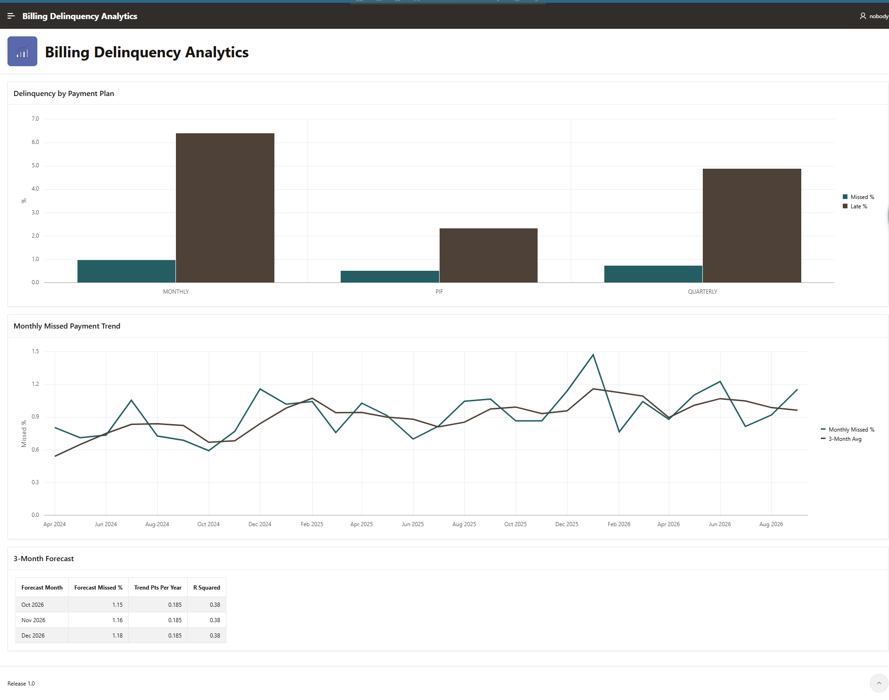
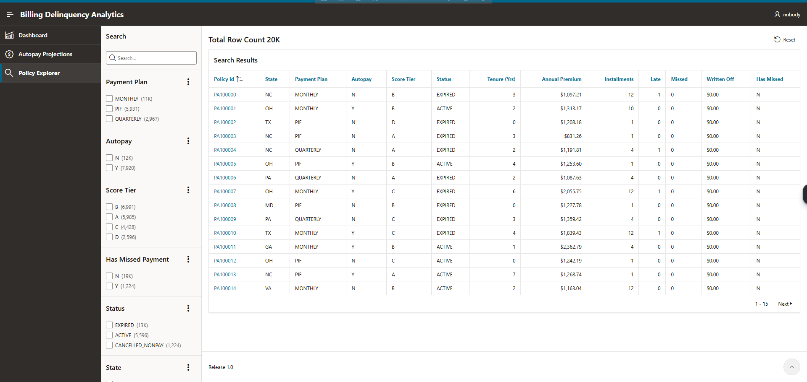
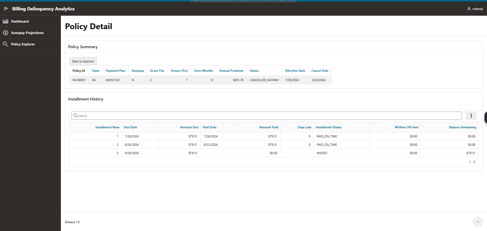
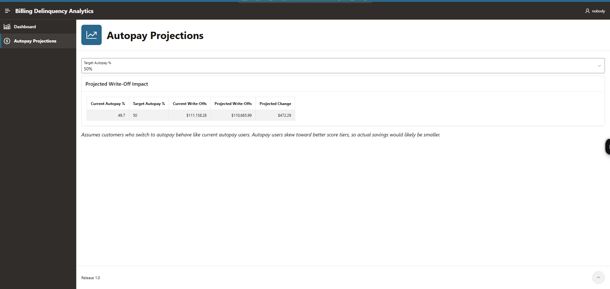
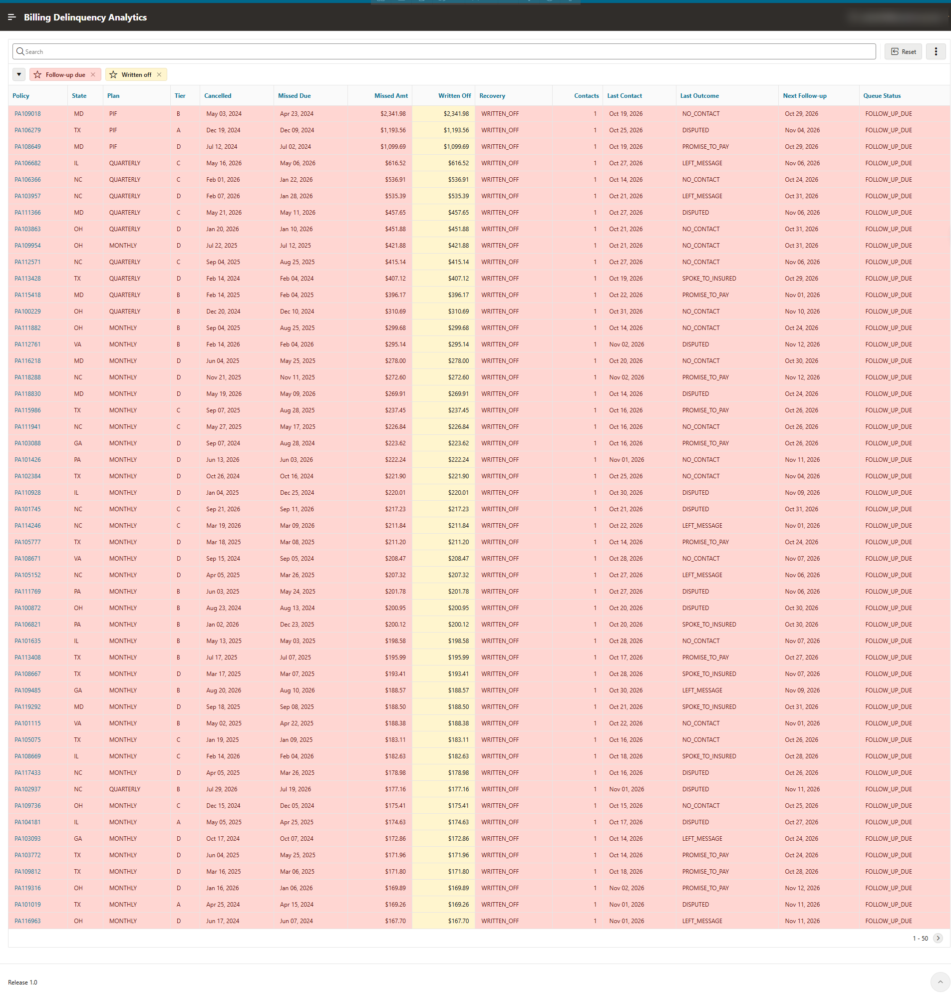
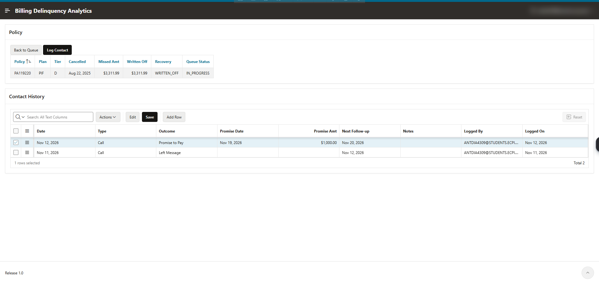
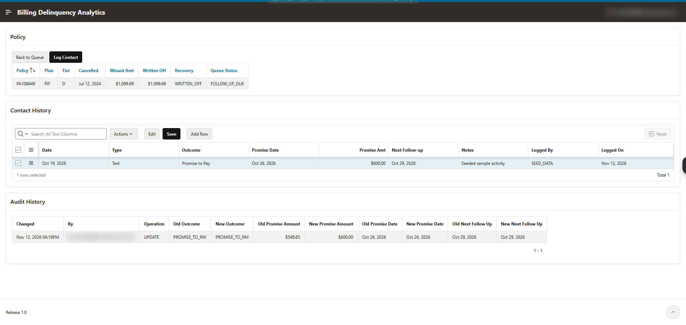
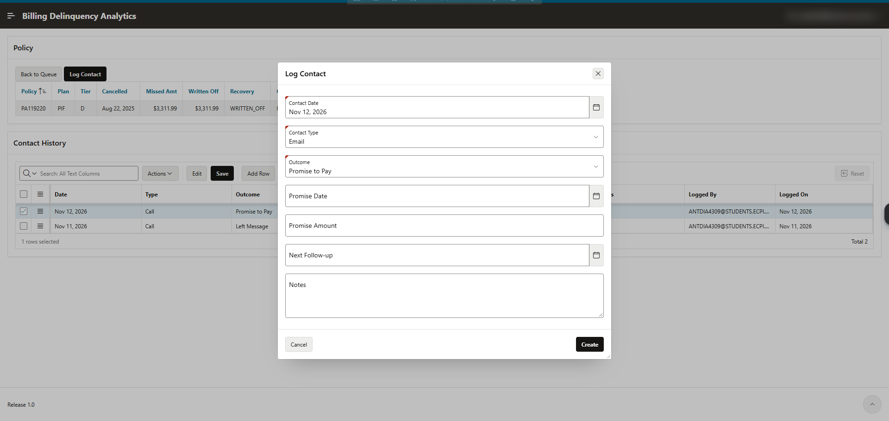
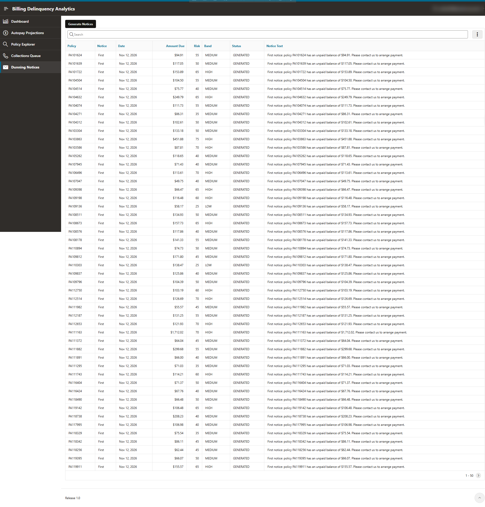

# Billing Delinquency Analytics

Billing delinquency analysis and a collections workbench on a synthetic P&C insurance book, built with **Oracle SQL**, **PL/SQL**, and **Oracle APEX**.

**🔗 Live app:** [Billing Delinquency Analytics](https://oracleapex.com/ords/r/antdia4309_ecpi/billing-delinquency-analytics/home)



---

## The business question

Missed installments turn into cancellations and write-offs. This project looks at three questions a billing or finance team would ask:

1. **Where does delinquency come from?** Which payment plans, autopay statuses, and risk tiers drive missed payments and bad debt?
2. **Where is it heading?** What's the trend, and what should we expect over the next quarter?
3. **What would autopay adoption be worth?** If more customers moved to autopay, how much would write-offs change?
4. **How do we work the delinquent accounts?** Which accounts need attention today, how risky is each one, and what's happened on it so far?

---

## The data

All data is **synthetic**. No real policyholder data is used.

| Table | Rows | Grain |
|---|---|---|
| `POLICIES` | 20,000 | One row per policy: payment plan, autopay flag, score tier, A/B group |
| `INSTALLMENTS` | 131,425 | One row per billed installment: due date, status (paid / late / missed), written-off amount |

The data was generated with [`data/generate_billing_data.py`](data/generate_billing_data.py), which builds in realistic patterns:

- Three payment plans: **Monthly**, **Quarterly**, and **Paid in Full (PIF)**
- Autopay users skew toward better score tiers
- A Dec/Jan seasonal bump in missed payments
- A slow upward drift in delinquency over time
- A reminder-email A/B test, split by even vs. odd policy number
- A missed installment cancels the policy after a 10-day grace period
- About **35% of missed installments are recovered** through collections ($0 written off); the rest are written off in full

**Reproducible:** the generator uses a fixed random seed, so running

```bash
pip install pandas numpy
python generate_billing_data.py --policies 20000
```

recreates the exact dataset used in the app. The CSVs were then loaded into Oracle APEX through **SQL Workshop → Data Workshop**.

---

## The SQL

Analysis queries 1–6 are in [`sql/analysis_queries.sql`](sql/analysis_queries.sql). Phase 1 queries 7–8 are in [`sql/phase1_explorer_queries.sql`](sql/phase1_explorer_queries.sql). Phase 2 objects 9–12 are in [`sql/phase2_collections.sql`](sql/phase2_collections.sql). Phase 3 objects 13–16 are in [`sql/phase3_collections_pkg.sql`](sql/phase3_collections_pkg.sql).

| # | Query | Techniques | Used in app |
|---|---|---|---|
| 1 | Delinquency by payment plan | CTE, conditional aggregation | Bar chart |
| 2 | Risk segments (plan × autopay × tier) | `RANK()`, `RATIO_TO_REPORT`, running totals | — |
| 3 | Monthly trend | `LAG` (year-over-year), 3-month moving average | Line chart |
| 4 | Reminder email A/B test | Relative lift, two-proportion z-score | — |
| 5 | 3-month forecast | `REGR_SLOPE`, `REGR_INTERCEPT`, `REGR_R2`, `CONNECT BY LEVEL` | Forecast table |
| 6 | Autopay scenario | Bind variable from page input, weighted projection | Autopay Projections page |
| 7 | `POLICY_EXPLORER_V` view | `LEFT JOIN` rollup, conditional aggregation, BOOLEAN → text conversion | Policy Explorer |
| 8 | Policy detail | Bind variable from link, derived balance column | Policy Detail |
| 9 | `COLLECTION_ACTIONS` table | Identity key, foreign key, check constraints, `DEFAULT ON NULL` audit columns | Collections workbench |
| 10 | `COLLECTIONS_QUEUE_V` view | `KEEP (DENSE_RANK LAST)` for latest action, derived status and priority | Collections Queue |
| 11 | Workbench validations | PL/SQL expressions on grid rows and form items | Policy Collections, Log Contact |
| 12 | Seed activity (optional) | Repeatable sample data with `ORA_HASH` | — |
| 13 | Audit table and trigger | Row-level `AFTER` trigger, `:OLD`/`:NEW`, `INSERTING`/`UPDATING` | Audit History |
| 14 | `DUNNING_NOTICES` table | Unique key on policy + level to prevent duplicate notices | Dunning Notices |
| 15 | `COLLECTIONS_PKG` package | Spec vs. body, functions and procedures, cursor FOR loop, `%TYPE`, exception handling, private helper | Queue risk score, Generate Notices |
| 16 | Package tests | Anonymous PL/SQL blocks, `DBMS_OUTPUT`, simulated dates | — |

---

## The app

Built in Oracle APEX. The analytics pages are public; the collections workbench requires a login.

### Analytics (public)

**Dashboard.** Delinquency by payment plan, the monthly missed-payment trend with a 3-month moving average, and a 3-month forecast. Click any bar to drill into those policies.

**Policy Explorer.** A faceted search over all 20,000 policies. Filter by payment plan, autopay, score tier, missed-payment status, policy status, and state, with live counts on every facet. Click a policy ID to open its detail page.



**Policy Detail.** The policy's summary plus its full installment history: due and paid dates, days late, status, write-offs, and the balance left unpaid at each due date.



**Autopay Projections.** A what-if tool. Pick a target autopay adoption rate (40–80%) and the projected write-offs recalculate live.



### Collections workbench (login required)

**Collections Queue.** Every policy with a missed payment, prioritized for a collector: overdue follow-ups first, then accounts never contacted, then in-progress, then closed. Within each group, accounts are ordered by a 0–100 **risk score** calculated in PL/SQL. Overdue rows are highlighted red, HIGH-risk bands dark red, and written-off balances amber.



**Policy Collections.** One policy's contact history in an editable Interactive Grid. Collectors can add, fix, or remove contact attempts inline, and the policy's queue status updates on save. An **Audit History** region shows every change to that history, with who made it, when, and the before/after values, captured by a database trigger.





**Log Contact.** A modal form for logging a call, email, letter, or text. Promise-to-pay fields only appear when the outcome is Promise to Pay, and validations catch missing or inconsistent promises before they reach the database.



**Dunning Notices.** Escalating notices (first, second, final) for written-off balances. The **Generate Notices** button calls a PL/SQL procedure that skips closed accounts, honors active promises to pay, waits at least 14 days between notices, and never sends the same notice twice. Each notice carries the policy's risk score at the time it was generated.



### Setup

The APEX app export is in [`apex/f188112.sql`](apex/f188112.sql). To run it in your own workspace:
1. Import it through **App Builder → Import**.
2. Load the two tables from the generator's CSVs.
3. Run [`sql/phase1_explorer_queries.sql`](sql/phase1_explorer_queries.sql) to create the `POLICY_EXPLORER_V` view.
4. Run [`sql/phase2_collections.sql`](sql/phase2_collections.sql) to create the collections table and queue view (the seed script at the end is optional).
5. Run [`sql/phase3_collections_pkg.sql`](sql/phase3_collections_pkg.sql) to create the audit trigger, notices table, and `COLLECTIONS_PKG` package.

---

## Key findings

**Payment plan matters most.** Monthly plans have the highest late rate (~6.4%) and missed rate (~1.0%). Quarterly plans come next (~4.9% late), and Paid in Full is lowest (~2.3% late, ~0.5% missed).

**Delinquency is seasonal.** Missed payments spike in December/January both years, peaking around 1.5% in Jan 2026, then fall back.

**The trend is drifting up.** The regression trend adds about **0.19 points per year** to the missed rate, with a forecast of ~1.15–1.18% for Oct–Dec 2026.

**Every miss ends in cancellation.** 1,224 policies have a missed payment, and the same 1,224 are cancelled for nonpayment. Of those, 1,113 (91%) are on monthly plans.

**Autopay adoption has real value.** Current autopay adoption is **49.7%**, with **$111K** in write-offs. The scenario model projects:

| Target autopay | Projected write-offs | Change |
|---|---|---|
| 40% | $124,698 | −$13,539 |
| 60% | $96,674 | +$14,484 |
| 70% | $82,663 | +$28,496 |
| 80% | $68,651 | +$42,507 |

---

## Caveats

- **Autopay selection bias.** The scenario assumes customers who switch to autopay behave like current autopay users. Current users skew toward better score tiers, so real savings would likely be **smaller** than projected. A fairer estimate would compare autopay vs. non-autopay *within* each score tier.
- **Moderate forecast fit.** The linear trend has an R² of **0.38**, so it explains only part of the month-to-month variation. Seasonality accounts for much of the rest. Treat the forecast as directional.
- **Early-month ramp-up.** Jan–Mar 2024 are excluded from the trend chart. The book was still ramping up and only first installments were due, which made those months look artificially low.
- **Write-offs are per installment.** Only the missed installment is written off. Once a policy cancels, its remaining installments are never billed, so unearned premium isn't counted.
- **Rule-based risk score.** The risk score is a transparent weighted rule set, not a trained model. Every score can be explained factor by factor, but the weights are judgment calls, not fitted to outcomes.
- **Seeded collections activity.** Contact history in the workbench is sample data from the seed script, tagged `SEED_DATA`. It shows how the queue behaves, not real collection results.
- **Synthetic data.** The patterns are built in on purpose. The point of the project is the method, not the specific numbers.

---

## Release history

| Version | Phase | What changed |
|---|---|---|
| v1.0 | Analytics dashboard | Dashboard, trend and forecast, autopay scenario tool |
| v1.1 | Phase 1: Drill-down & exploration | Policy Explorer (faceted search), Policy Detail page, chart-to-explorer drill-down |
| v1.2 | Phase 2: Collections workbench | Collections Queue, Policy Collections (editable grid), Log Contact modal form, login-protected pages |
| v1.3 | Phase 3: PL/SQL business logic | Audit trigger, `COLLECTIONS_PKG` (risk score, dunning notices), Dunning Notices page, Audit History region |

**Implementation notes from Phase 1:**
- `AUTOPAY_FLAG` loaded as an Oracle `BOOLEAN`, which the faceted search wizard can't use as a facet. The view converts it to `'Y'`/`'N'` text.
- In APEX 26, a facet value passed through a link needs a one-character filter prefix: `I` to include, `E` to exclude. The chart links set `P4_PAYMENT_PLAN = I&PAYMENT_PLAN.` with Clear Cache `4,RP`.

**Implementation notes from Phase 2:**
- **Validation in two layers.** APEX validations give users clear, inline messages; table check constraints stay underneath as a backstop so bad data can't get in through any other path.
- **Grid values are text.** In Interactive Grid validations, values arrive formatted (`$500.00`, `Nov 18, 2026`), so the expressions strip currency symbols and parse dates with the column's format mask.
- **Database-owned audit columns.** `CREATED_BY` and `CREATED_ON` are filled by `DEFAULT ON NULL` defaults, so the APEX columns are set to Query Only and left out of inserts.
- **Priority, not alphabet.** Sorting the queue by status text put closed accounts first, so the view adds a numeric `QUEUE_PRIORITY` that drives the default sort.
- **Writable pages need a login.** The workbench pages require authentication and their menu entry is hidden from public visitors, while the analytics pages stay public.

**Implementation notes from Phase 3:**
- **Business logic lives in the database.** Risk scoring and dunning rules are in a PL/SQL package, so any screen, report, or future API gets the same answer. APEX only calls the package's public interface.
- **Private functions can't be called from SQL.** The notice-text helper is private to the package body, so the procedure computes it in PL/SQL before the `INSERT` instead of calling it inside the SQL statement.
- **Watch out for NULL in `NOT (...)`.** The first version of the promise-to-pay check silently skipped every never-contacted account, because `NOT (NULL = 'X' AND ...)` evaluates to unknown and the row is dropped. `NVL` around the nullable columns fixed it, taking first notices from 266 to the expected ~720.
- **Double protection against duplicate notices.** The procedure enforces a 14-day gap and a three-notice cap, and a unique key on policy + notice level backs it up in the database.
- **Audit rows outlive the data.** The audit table has no foreign key to the actions table, so history survives when a contact attempt is deleted.
- **New columns on a saved Interactive Report start hidden.** After changing a report's source, new columns land on the Do Not Display list and have to be added back through Actions → Columns.

---

## Possible next steps

- **Phase 4:** automations to flag newly at-risk policies nightly
- **Phase 5:** roles (Collector vs. Manager) with authorization schemes
- Add a seasonal factor to the forecast
- Add a grace-period scenario (e.g., 10 → 20 days)
- Re-run the autopay scenario within score tiers to correct for selection bias

---

## Repo structure

```
├── README.md
├── apex/
│   └── f188112.sql                   # Oracle APEX app export
├── data/
│   └── generate_billing_data.py      # Synthetic data generator
├── sql/
│   ├── analysis_queries.sql          # Analysis queries 1–6
│   ├── phase1_explorer_queries.sql   # Phase 1: explorer view + detail queries
│   ├── phase2_collections.sql        # Phase 2: collections table, queue view, seed data
│   └── phase3_collections_pkg.sql    # Phase 3: audit trigger, notices table, COLLECTIONS_PKG
└── screenshots/
```

---

*Built by Antonio Diaz.*
